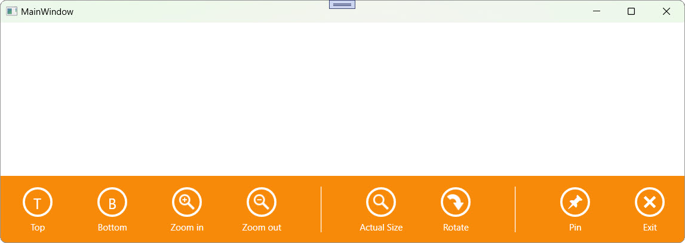

<!-- default badges list -->

<!-- default badges end -->

# WPF AppBar - Display a Top or Bottom Window Menu Inspired by Windows 10

This example uses the WPF [`AppBar`](https://docs.devexpress.com/WPF/DevExpress.Xpf.WindowsUI.AppBar) control to display a Windows 10–style menu at the top or bottom of a window.
 
Commands appear as circular buttons, including the built-in **Exit** command, the **Pin** command that works as a toggle, and the **Rotate** button that opens a flyout (context) menu with related actions. **Top** and **Bottom** buttons align the `AppBar` to the corresponding edge of the window.
 
The [`AppBar.HideMode`](https://docs.devexpress.com/WPF/DevExpress.Xpf.WindowsUI.AppBar.HideMode) property is set to `Sticky` so the command bar remains visible until the user hides it manually with the **Exit** button.

## Files to Review

* [MainWindow.xaml](./CS/AppBarExample/MainWindow.xaml) (VB: [MainWindow.xaml](./VB/AppBarExample/MainWindow.xaml))
* [MainWindow.xaml.cs](./CS/AppBarExample/MainWindow.xaml.cs) (VB: [MainWindow.xaml.vb](./VB/AppBarExample/MainWindow.xaml.vb))

## Documentation

* [AppBar](https://docs.devexpress.com/WPF/DevExpress.Xpf.WindowsUI.AppBar)
* [AppBarButton](https://docs.devexpress.com/WPF/DevExpress.Xpf.WindowsUI.AppBarButton)
* [AppBarToggleButton](https://docs.devexpress.com/WPF/DevExpress.Xpf.WindowsUI.AppBarToggleButton)
* [AppBarSeparator](https://docs.devexpress.com/WPF/DevExpress.Xpf.WindowsUI.AppBarSeparator)
* [IsExitButtonEnabled](https://docs.devexpress.com/WPF/DevExpress.Xpf.WindowsUI.AppBar.IsExitButtonEnabled)
* [AppBarButton.Label](https://docs.devexpress.com/WPF/DevExpress.Xpf.WindowsUI.AppBarButton.Label)
* [CommandButton.Glyph](https://docs.devexpress.com/WPF/DevExpress.Xpf.WindowsUI.CommandButton.Glyph)
* [MenuFlyout](https://docs.devexpress.com/WPF/DevExpress.Xpf.WindowsUI.MenuFlyout)

## More Examples

* [WPF Data Grid – Specify Custom Content for Column Chooser Headers](https://github.com/DevExpress-Examples/wpf-data-grid-custom-content-for-column-chooser-headers)
* [WPF Data Grid – Handle Drag and Drop Operations](https://github.com/DevExpress-Examples/wpf-grid-handle-drag-and-drop)
* [WPF Data Grid – Bind to Dynamic Data](https://github.com/DevExpress-Examples/wpf-bind-gridcontrol-to-dynamic-data)
* [WPF Scheduler - Filter Time Regions](https://github.com/DevExpress-Examples/wpf-scheduler-filter-time-regions)
* [WPF Scheduler - Apply User Restrictions](https://github.com/DevExpress-Examples/wpf-scheduler-apply-end-user-restrictions)

<!-- feedback -->
## Does this example address your development requirements/objectives?

 

(you will be redirected to DevExpress.com to submit your response)
<!-- feedback end -->
